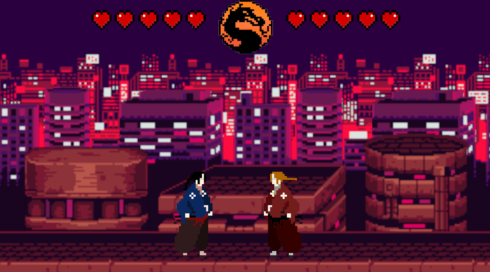
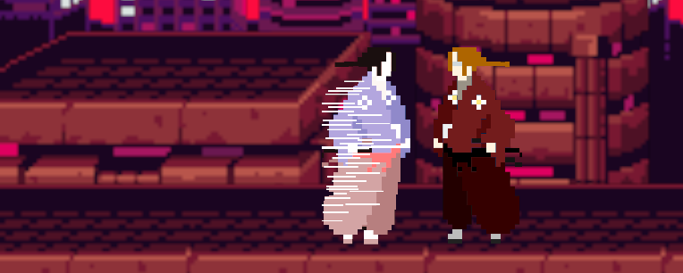

# Rustal Kombat

## Authors
Kamil Bugała, @Emilo77 on Github

## Description

I created a game in the style of Mortal Kombat.
Two players fight each other by using dashes.
It is the 1 v 1 version, so far it is possible to play on one computer:
- first player controls WASD
- second player controls arrows

## Functionality
- Generating structures and animations with sprite sheets
- Generating map and decorations
- Players movement system

## Game engine
### Bevy
<a href="https://bevyengine.org/" rel="yolo"><a/>
I chose to use the Bevy engine due to the popularity and the good documantation of this engine.

Significantly useful for me were:
- [Bevy cheetbook](https://bevy-cheatbook.github.io/)
- [Bevy examples](https://github.com/bevyengine/bevy/tree/latest/examples#examples)
- [Flappy bevy](https://www.youtube.com/watch?v=Qjc0V58lB7A)
- [Tutorial seby](https://dev.to/sbelzile/rust-platformer-part-1-bevy-and-ecs-2pci)

#### Feel free to play!

<a href="https://bevyengine.org/" rel="yolo"><a/>
<a href="https://bevyengine.org/" rel="yolo"><a/>

  
